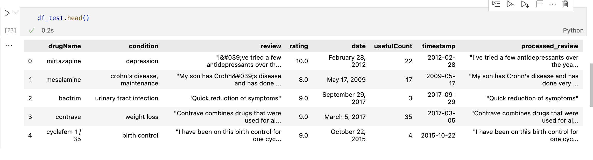

Introduction of your project. Why chosen? why is it cool? General/Broader impact of having a good predictive mode. i.e. why is this important?
> The project was chosen because data analysis is becoming an increasingly important tool for comprehending patient experiences and outcomes associated with pharmaceutical treatments. The project intends to leverage machine learning (ML) to identify trends in reviews, specifically understanding what constitutes a good review in the eyes of others, even if humans cannot directly identify such trends on extremely large datasets.
> The reason this project is interesting is that it uses natural language processing (NLP) techniques to analyze the sentiment found in drug reviews—a valuable but little-used source of data. By utilizing real-world experiences, sentiment analysis of user evaluations provides a more comprehensive insight of drug performance than is possible with traditional clinical trial results.
> An effective prediction model for assessing drug evaluations can be especially important for identifying what sort of experiences using said products have on consumers. A bad experience needs to be addressed, and a good experience should be further built upon. Identifying what is good and what is bad, what kind of things leads to higher or lower ratings for a product, can be difficult with the complexities of language, but being able to parse through superfluous noise and being able to correctly predict what kind of experiences with a product can lead to a good review is crucial for being able to build upon what works in future endeavors.

Methods section (this section will include the exploration results, preprocessing steps, models chosen in the order they were executed. Parameters chosen. Please make sub-sections for every step. i.e Data Exploration, Preprocessing, Model 1, Model 2, Model 3, (note models can be the same i.e. CNN but different versions of it if they are distinct enough). You can put links here to notebooks and/or code blocks using three ` in markup for displaying code. so it would look like this: ``` MY CODE BLOCK ```
* Note: A methods section does not include any why. the reason why will be in the discussion section. This is just a summary of your methods
> #### Data Exploration
> * In our data exploration phase, we first filtered out non-informative entries from the 'condition' column using string matching to discard placeholder text. We employed str.contains() to identify and remove these rows, streamlining our dataset for analysis. To understand the dataset's range, we calculated the unique values in 'condition' and 'drugName' fields with len(set()), highlighting the variety of drugs and conditions present. Next, we transformed the 'date' column to timestamps for better chronological analysis using the pd.Timestamp() method. We also cleaned the dataset by dropping unwanted columns with drop(columns="Unnamed: 0"). A quick preview using .head() confirmed the cleanliness and structure of our data, setting a solid base for the predictive modeling to follow.
> #### Preprocessing
> * In the data preprocessing phase of our project, we transformed the raw drug review dataset into a clean, machine-learning-ready format. Text normalization procedures like converting to lowercase and removing special characters and contractions standardized the dataset. We tokenized the reviews, excised stopwords, and applied lemmatization to distill the text down to its most informative elements. To accommodate categorical data within our models, we implemented one-hot encoding, converting categorical variables into a binary matrix. After purging extraneous features, the refined dataset was preserved as a CSV file, ensuring the readiness of our data for the analytical rigor ahead.
> 
> #### Model 1.1 - Decision Tree Regressor
> * We created a Decision Tree Regressor to predict on our dataset after preprocessing. We loaded the reviews using word embedding, while one-hot encoding the drug names and the conditions for each entry. These were passed in the pipeline to the decision tree regressor, which predicted the rating of a given review as a continuous numerical value. To evaluate its performance, we looked at the mean squared error.
> #### Model 1.2 - Simple Linear Regression
> * In addition to the Decision Tree Regressor, we chose to add a simple linear regression model to our submission to see how it performs with the same preprocessing as the decision tree regression model. It predicted a continuous integer value that represents the rating given by the reviewer.
> #### Model 2 - Text Vectorization with Neural Network
> * The first attempt used a neural network to predict ratings. The model would treat integer ratings from 1 to 10 as ten different categories and use sparse categorical cross entropy to sort each entry into a rating category. The only feature would be the review text and the prediction would be the category in integers 1 to 10. In order to feed review text into the neural network, the model uses text vectorization to convert words to numbers based on weight. For the model architecture, we made a neural network with two dense layers. The first dense layer has $4000$ units and the second has $2000$ units, and both use the ReLU activation function. It predicts a single continuous value for the predicted rating.
> #### Model 3 - Neural Network Regressor using BERT word embeddings
> * We preprocessed the data without lemmatizing and removing stop words like in the previous models. Furthermore, we appended an extra sentence to the reviews that includes the number of users that found the review helpful. We also decided to split our test data into a validation set and a test set. Using this new method to process the reviews, we fine-tuned a pre-trained BERT language model from Hugging Face on our processed text reviews to predict a continuous numerical value for the rating.

Results section. This will include the results from the methods listed above (C). You will have figures here about your results as well.
* No exploration of results is done here. This is mainly just a summary of your results. The sub-sections will be the same as the sections in your methods section.
> #### Model 1.1 - Decision Tree Regressor
> * MSE Train: $0.00012225858631456193$
> * MSE Test: $6.0234962406015044$
> #### Model 1.2 - Simple Linear Regression
> * MSE Train: $2.7201500032101595$
> * MSE Test: $6.324225401173784$
> #### Model 2 - Text Vectorization with Neural Network
> * MSE Train : $6.408446640685858$
> * MSE Test: $9.6741797$
> #### Model 3 - Neural Network Regressor using BERT word embeddings
> * MSE Train: $1.10432768$
> * MSE Validation: $2.03449368$
> 
> 
> 
> * MSE Test: $2.01165271$

Discussion section: This is where you will discuss the why, and your interpretation and your though process from beginning to end. This will mimic the sections you have created in your methods section as well as new sections you feel you need to create. You can also discuss how believable your results are at each step. You can discuss any short comings. It's ok to criticize as this shows your intellectual merit, as to how you are thinking about things scientifically and how you are able to correctly scrutinize things and find short comings. In science we never really find the perfect solution, especially since we know something will probably come up int he future (i.e. donkeys) and mess everything up. If you do it's probably a unicorn or the data and model you chose are just perfect for each other!
> #### Model 1.1 - Decision Tree Regressor
> * We decided to try using a Decision Tree because those types of models tend to be able to predict.The aim was to model the relationship between user ratings and drug reviews using decision tree regression analysis. The almost perfect training R2 indicated overfitting, and a much lower test R2 and a greater mean squared error. This result emphasizes the decision tree's tendency to memorize training data, an error that emphasizes the importance of selecting models carefully and fine-tuning their parameters. Even though the outcomes are not perfect, 
> #### Model 1.2 - Linear Regression
> * The training data in our study showed a reasonable R² of 0.746 for the Linear Regression model; however, a significant decline to 0.414 for the test data indicated a mismatch in prediction performance, indicating overfitting. This is supported by the increase in mean squared error, which shows less accurate predictions for unknown data, from 2.72 in training to 6.32 in testing. These findings suggest that the model is not fully capable of representing the complex, possibly non-linear relationships present in the dataset, indicating the necessity of improved modeling methods .
> #### Model 2 - Text Vectorization with Neural Network
> * This model takes a long time to train. When testing, the model was either under trained (because we do not want to invest too much time training a model we are not sure about), resulting in horrible performance, or the model did not run at all due to incorrect vectorization process or size mismatch.
> #### Model 3 - Neural Network Regressor using BERT word embeddings
> * The reason we chose to fine-tune a pre-trained model is because we wanted to experiment with the process of doing so rather than repeating the process of building from the ground up, since using pre-trained models have their own challenges and issues to learn from. Furthermore, we wanted to experiment with a different word embedding method compared to TF-IDF, which we used for the other models. From our research, BERT is a context-dependent model, unlike TF-IDF which is context independent, so we wanted to see how it compared to our previous attempts. 
> * We initially tried training it on the same preprocessed data like in the other examples, but we realized that, since it uses a context-dependent word-embedding, there is a higher chance that removing and altering the text data through lemmatization and removing stop words would be removing relevant information for fine-tuning the model. Thus, we tried running the model on $10\%$ on each of the datasets using the same random states to see how they compared when fine-tuning a BERT model. We found, in our rather limited attempts to test our idea, that keeping the words unaltered folding in a new sentence that contained the numerical information of useful_count showed the lowest loss among the three test models.
> * Regarding our choice in making a validation set, we decided to do so since the previous split on training and testing datasets was about $75-25$. Thus, we decided to split the test set so that we had a $75-10-15$ train-validation-test split that we hoped would prevent overfitting on the training data.
> * Given the issue of the time to fine-tune a neural network like a BERT language model, we chose to train it on a subset of $70/%$ of the data, and train for $10$ epochs. Compared to the other models, it performed much better with a much smaller loss across the board for training, validation, and testing. However, despite this success, we found that looking at an approximated accuracy for our model’s prediction, we see that our model is not extremely accurate. Compared to the approximated accuracy from the linear regression model, model 3 has a lower accuracy. While we understand that we are not training our model on accuracy, since we want to try to predict a continuous value given that there exists significance of the proximity between predicted values, it is something that we were trying to improve on even to the final day of the submission.


Conclusion section: This is where you do a mind dump on your opinions and possible future directions. Basically what you wish you could have done differently. Here you close with final thoughts
> * For the BERT model, we could have implemented some form of hyperparameter tuning so the training arguments could improve the model’s performance to the highest degree. Instead of using train_test_split, we could have used cross-validation on our dataset so it would better fit the data and there’s less variability on each run as opposed to split. A major issue we ran into is that when we used a 70% split and tried testing the model output Google Colab would time out and run out of GPU usage and even when the couple people in our group used their built-in GPUs and ran the model locally it would take 40 minutes to an hour to train the model. To prevent overfitting we could have implemented some sort of regularization, probably L2, although we didn’t need it because we ran different splits on the dataset it could have helped. As far as ideas upon expanding upon model 3 goes we originally wanted to add a neural network layer to further explore deeper relationships in the data set. We tried to implement Fully connected dense neural network connecting the output of the BERT model to the input of the DNN with a softmax activation function. We weren’t able to discover anything interesting no matter how many different layers or configurations we used and the more layers we added the longer the training time had become. The goal was to achieve better sentiment analysis than what we had but we realized fast that it became computationally too expensive. We could have implemented some kind of early stopping if the accuracy of the model dipped too low too early to reduce training time if it looked like the expanded model was going nowhere. There was nothing much that we could think of to improve model 1 or 2, excluding pruning on the decision tree and experimenting more with the hyperparameters in the deep neural network. However, both options seemed rather time-consuming given the limited amount of time we have in a single quarter. While we were interested in pursuing these avenue of architecture, we felt that we wanted to experiment more with new concepts. However, looking back, we felt that, if we had more time, we would have tried to improve all our models that we've worked on through the quarter. Considering everything this was an insightful project that deepened all of our understanding about machine learning models.

Collaboration section: This is a statement of contribution by each member. This will be taken into consideration when making the final grade for each member in the group. Did you work as a team? was there a team leader? project manager? coding? writer? etc. Please be truthful about this as this will determine individual grades in participation. There is no job that is better than the other. If you did no code but did the entire write up and gave feedback during the steps and collaborated then you would still get full credit. If you only coded but gave feedback on the write up and other things, then you still get full credit. If you managed everyone and the deadlines and setup meetings and communicated with teaching staff only then you get full credit. Every role is important as long as you collaborated and were integral to the completion of the project. If the person did nothing. they risk getting a big fat 0. Just like in any job, if you did nothing, you have the risk of getting fired. Teamwork is one of the most important qualities in industry and academia!!!
* Start with Name: Title: Contribution. If the person contributed nothing then just put in writing: Did not participate in the project.

> Kenneth Chuang - Programmer:
> * I worked on model 2, implementing sentiment analysis and deep neural networks. This proved to be inferior to model 1’s linear regression.
>
> Steven Liu - Programmer:
> * I worked in helping with the code for model 1 and model 3, and helped with the write ups for many of the milestones
>
> Wesley Hu - Programmer:
> * I worked on model 2, testing the linear regression model with tf-idf. However, that model proved to be inferior to the decision tree model. Did parts of data exploration for milestone 2.
>
> Hantian Lin - Programmer:
> * I mainly worked on Milestone 1 on picking and describing the dataset and on Milestone 4 on building Model 2.
>
> Niharika Malhotra - Programmer:
> * I mostly did preprocessing for milestone 3 and worked on Model 1.
>
> Neal Parimoo - Programmer/Writer:
> * I helped work on model 3 and preprocessing the data. Worked on write-ups as well.
>
> Madhav Bansal - Programmer:
> * I helped working on model 1, testing on the decision tree and tried improving the model. I also helped in the preprocessing required for model 2.
>
> Zhirui Xia - Programmer:
> * Worked on model 1 for both the decision tree and the linear regression, and worked on trying to improve the model 3.
>
> Safia Mahamed - Programmer/Writer:
> * I mostly worked on the write up, summarizing the models and worked in model 3.
>
> Zixuan Chen - Programmer/Tester:
> * Mostly ran the code/tested the code for model 3 and helped look into documentation.